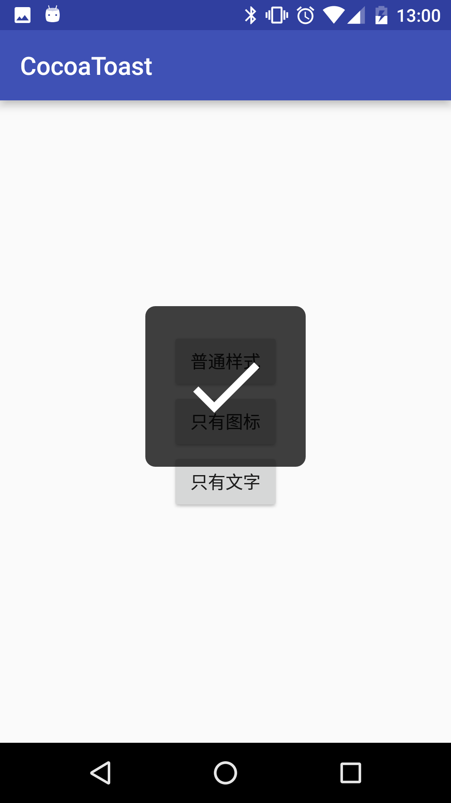

# CocoaToast

A iOS-like toast for Android

# Screenshot

<p align="center">



</p>

# Use

[](https://jitpack.io/#twiceyuan/CocoaToast)

Normal(has default icon)
```java
CocoaToast.show("Submit Success");
```

Only Icon
```java
CocoaToast.showIconOnly(R.drawable.better_toast_ic_done_white);
```

Only Text
```java
CocoaToast.showTextOnly("Submit Success");
```

Init
```java
CocoaToast.init(getApplicationContext());

// or
Config config = ...;
CocoaToast.init(getApplicationContext(), config);
```

Config
```groovy
repositories {
	...
	maven { url "https://jitpack.io" }
}

dependencies {
  compile 'com.github.twiceyuan:CocoaToast:1.0'
}
```
